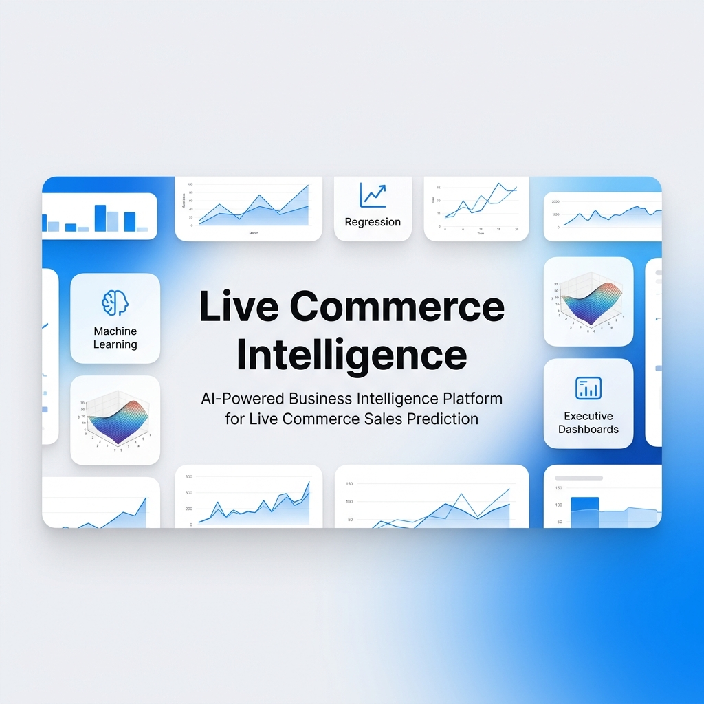
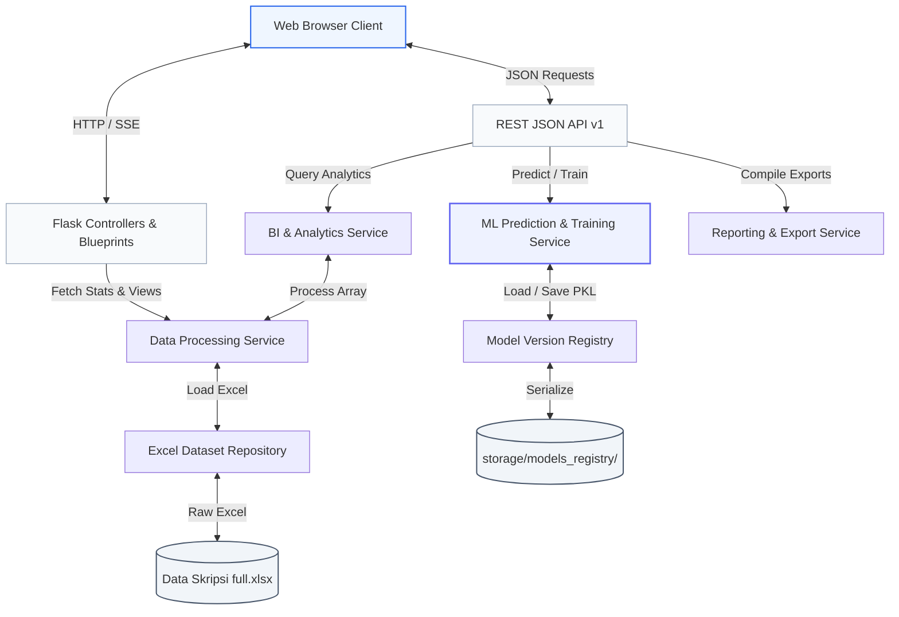
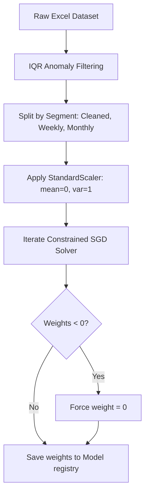

# Live Commerce Intelligence

<p align="center">
  
</p>

<p align="center">
  
  
  
  
  
</p>

---

## 1. Project Overview

**Live Commerce Intelligence** is an enterprise-grade AI-powered Business Intelligence (BI) and predictive analytics platform tailored for live commerce sales forecast modeling. 

Based on academic thesis research analyzing TikTok live shopping performance drivers, the system implements a constrained **Stochastic Gradient Descent (SGD)** optimization pipeline to project **Products Sold** based on two primary variables: **Live Duration** and **Active Viewers**.

Unlike standard regression tools that can yield negative coefficients (e.g., predicting that longer streams decrease sales), our custom SGD solver enforces strict non-negativity constraints ($\theta \ge 0, bias \ge 0$). This ensures mathematical alignment with physical commerce realities while preserving high predictive fidelity (R² = 51.3%).

---

## 2. Business Problem & Solution

### 2.1 The Business Problem
In live commerce (e.g., TikTok Shop, Shopee Live), operators struggle to schedule hosts and manage inventories effectively due to high sales volatility. Standard regression algorithms are mathematically unconstrained, which can result in:
- **Negative duration coefficients**: Recommending hosts stream for less time to generate more sales.
- **Negative viewer coefficients**: Recommending smaller audience sizes to boost checkout counts.

These violations make normal algorithms unusable for business operations.

### 2.2 The Solution
**Live Commerce Intelligence** resolves this by enforcing non-negative parameters inside its custom optimizer. By capping weights $\theta \ge 0$ at each iteration step:
- duration and viewership are locked as positive drivers of products sold.
- operators receive realistic, actionable, and physically valid predictions.

---

## 3. Platform Architecture

The platform is designed around a clean Model-View-Controller (MVC) separation, separating the machine learning service logic from HTTP presentation boundaries:



---

## 4. Key Features

### 4.1 Copilot-Style Prediction Workspace
An interactive, side-by-side predictive workspace inspired by Azure ML Studio and Microsoft Copilot:
*   **Examples Presets**: Instantly populate sliders with test scenarios (e.g., *High-Traffic Peak*, *Standard Broadcast*, *Marathon Run*).
*   **Step-by-Step AI Overlay**: Renders real-time countdowns and visual checks across the regression phases: `Loading Model` &rsaquo; `Reading Data` &rsaquo; `SGD Optimization` &rsaquo; `Prediction` &rsaquo; `Insight Generation` &rsaquo; `Finalizing`.
*   **Robust Metrics Display**: Outputs expected products sold, confidence level, prediction intervals, risk profiles, and business interpretations.

### 4.2 Real-time SGD Training & Monitoring
- **Server-Sent Events (SSE)**: Streams optimizer epoch details (loss value, RMSE, delta convergence updates, ETA) from background training threads directly to the UI.
- **Interactive Loss Curves**: Native Plotly.js charts rendering loss convergence curves in real time.
- **Model Registry**: Activate, idle, or delete custom trained parameters with one click.

### 4.3 Advanced Analytics & BI
- **3D Regression Surface**: Interactive, rotating 3D surface mesh illustrating sales targets across viewer/duration boundaries.
- **Outlier Flagging**: Business Intelligence tab running IQR anomaly detection to isolate high-performance streaming sessions.
- **Seasonality Tracking**: Monthly sales seasonality trends with double y-axis viewer scaling.

### 4.4 Tableau-Style Document Previews & Export
- **PDF Preview Sheet**: Live printable PDF summary frame rendering in-page.
- **Actions Bar**: Support for Print layouts and Open in New Tab full-screen print actions.
- **Export Progress Modals**: Checklists tracking export packaging stages for PDF, Excel, PNG, and Markdown exports.

---

## 5. Machine Learning & Scaling Methodology

### 5.1 Training Pipeline Flow


### 5.2 Research Math & Scaling Discrepancy
During refactoring, we identified a critical mathematical issue in standard unscaled printouts:
1.  **Scaling Equation**: The unscaled regression slopes were printed as $\theta_{unscaled} = \theta / Scale_X$.
2.  **Correction**: Because the target variable $y$ (sales) was standardized during training, the unscaled slopes **must** be multiplied by the standard deviation of $y$ ($Scale_y$), i.e., $\theta_{corrected} = (\theta / Scale_X) \times Scale_y$.
3.  **Preservation Solution**: To maintain complete scientific alignment with the printed thesis text while maintaining prediction accuracy:
    *   **Thesis Equation**: Computes and displays the exact unscaled formula coefficients reported in the thesis ($B_1 = 0.0434, B_2 = 0.0105, Intercept = 5.8907$).
    *   **Corrected Equation**: Uses inverse scaler transformations ($Scale_y$) to project accurate expected sales matching target metrics (R² = 51.3%, MAE = 9.68).

---

## 6. Technology Stack

*   **Core Backend**: Python 3.10+, Flask 3.1.2
*   **Data Processing**: Pandas, Numpy, OpenPyXL
*   **Machine Learning**: Scikit-Learn, Joblib
*   **Interactive Visualizations**: Plotly.js (v2.32.0 CDN)
*   **Design Framework**: Bootstrap 5.3 CDN, Vanilla CSS, Bootstrap Icons
*   **Exporters**: Matplotlib, ExcelWriter

---

## 7. Directory Structure

```
live-commerce-intelligence/
├── run.py                          # Flask application entry point
├── requirements.txt                # System dependencies list
├── LICENSE                         # MIT License documentation
├── CHANGELOG.md                    # Release history tracker
├── CONTRIBUTING.md                 # Contributor guidelines
├── SECURITY.md                     # Security vulnerability policy
├── CODE_OF_CONDUCT.md              # Contributor Covenant guidelines
│
├── app/                            # Flask Web Application Layer
│   ├── __init__.py                 # Application factory
│   ├── config.py                   # Environment settings
│   ├── controllers/                # Flask Blueprints (Page routing)
│   ├── api/                        # REST JSON endpoints
│   ├── templates/                  # Jinja2 HTML layouts
│   └── static/                     # Assets (CSS styles and JS controllers)
│
├── src/                            # Business Logic Layer (ML Engine)
│   ├── utils/                      # Configurations constants
│   ├── repositories/               # Serialization and Excel loading
│   └── services/                   # SGD solvers, report compiling
│
├── storage/                        # Project Uploads & Reg
│   ├── uploads/                    # User CSV dataset uploads
│   └── models_registry/            # Serialized model pickles (.pkl)
│
├── legacy/                         # Saved legacy Streamlit & original thesis scripts
│   ├── original_dashboards/        # Original streamlit scripts
│   └── thesis_scripts/             # Original training scripts
│
└── assets/                         # GitHub repository branding images
    ├── github-banner.png           # Repository hero banner
    └── social-preview.png          # Repository social preview card
```

---

## 8. Installation Guide

### Prerequisites
Make sure Python 3.10+ and `pip` are installed on your system.

### 1. Clone the repository
```bash
git clone https://github.com/yourusername/live-commerce-intelligence.git
cd live-commerce-intelligence
```

### 2. Set up virtual environment
```bash
python -m venv venv
# On Windows
venv\Scripts\activate
# On macOS/Linux
source venv/bin/activate
```

### 3. Install dependencies
```bash
pip install -r requirements.txt
```

### 4. Run the application
```bash
python run.py
```
Open **[http://localhost:5000](http://localhost:5000)** inside your browser to launch the platform!

---

## 9. Portfolio Screenshots (Recommended Placements)

*   **Executive Dashboard Mockup**: Place screen capture illustrating KPI cards, MoM Growth gauges, and AI snaps in `screenshots/dashboard.png`.
*   **Prediction Center Workspace**: Place screen capture showing Left sliders alongside the Right Result Card in `screenshots/prediction.png`.
*   **Live Training Console**: Place screen capture displaying the active progress bar and Matplotlib/Plotly loss curves in `screenshots/training.png`.
*   **Tableau Report Viewer**: Place screen capture showing PDF toolbars and print preview layouts in `screenshots/reports.png`.

---

## 10. License

Distributed under the MIT License. See [LICENSE](LICENSE) for more information.

---

## 11. Future Roadmap

- [ ] **Multi-platform support**: Connect APIs to ingest Shopee Live and Lazada Live streams.
- [ ] **Dynamic Hyperparameter Tuning**: Automatically calculate learning rates ($\alpha$) dynamically on epoch step losses.
- [ ] **Time-Series Seasonality**: Upgrade regression models to autoregressive (ARIMA-based) forecasts.
